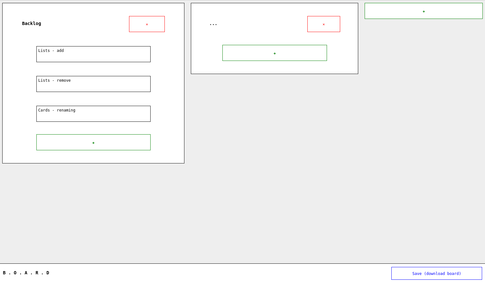

# Board

A task board that puts you in control of your data.

## Usage

The functionality of Board is very basic.

Each task you care about is represented by a card.  And cards belong to lists.

You can:

- import your task board from a file

- export your task board to a file

- add, delete, rename cards

- add, delete, rename lists

- move a card between lists

- re-order the cards within a list

- re-order the lists

- change the labels of a card

- change the notes for a card

That's it.

## Development

### Design documentation

See [design.md](docs/design.md).

### Setting up dev environment

- Have node, npm and typescript compiler installed.

- Install Browserify `npm install -g browserify`.

- Clone this repo, and run `npm install` from its top-level directory.

### Building

`npm run build`

The built app is located in `build/release/`.

### Running tests

`npm test`

### Running the app

`./run.sh`

May need to customize to use your browser, or a preferred port.

To kill server afterwards:

- Run `lsof -i :8000`.  Replace 8000 if you've used a different port.

- Identify PID of server.

- Kill the relevant process.
